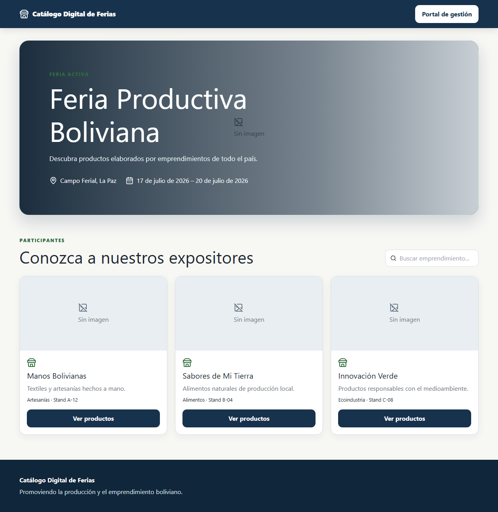
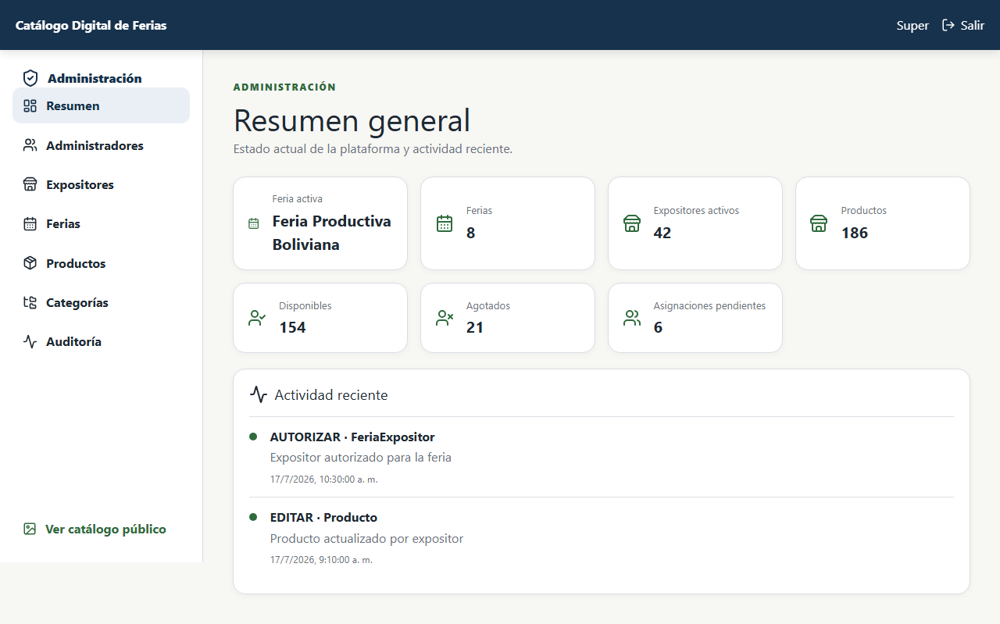

# Manual del frontend

## Accesos

- Catálogo público: `http://localhost:5173/catalogo`
- Portal de gestión: `http://localhost:5173/gestion/login`



## Catálogo público

El visitante puede consultar la feria activa, buscar expositores y entrar a la tienda de cada emprendimiento. Dentro de la tienda puede buscar y filtrar productos, abrir su ficha, seleccionar cantidades y generar una consulta por WhatsApp.

Los productos agotados permanecen visibles, pero no se pueden agregar. Si no existe una feria activa se muestra un mensaje informativo.

## Superadministrador

El rol `SUPERADMIN` puede:

- Consultar el resumen y la auditoría.
- Crear y administrar otras cuentas administrativas.
- Crear, editar, activar, inhabilitar o eliminar expositores.
- Administrar categorías, productos, imágenes, ferias y participantes.
- Restablecer contraseñas administrativas.



## Administrador del Viceministerio

El rol `ADMIN_VICEMINISTERIO` administra expositores, categorías, productos, ferias, participantes y auditoría. No puede acceder a la gestión de cuentas administrativas.

Las ferias se publican automáticamente por fecha. La interfaz solamente permite finalizar o cancelar una feria antes de que termine naturalmente.

## Expositor

El rol `EXPOSITOR` puede editar la información y logo de su empresa, y administrar únicamente sus productos e imágenes. Puede cambiar rápidamente la disponibilidad entre disponible, agotado e inactivo.

## Imágenes

- La portada de una feria se carga antes de crearla porque el contrato vigente del backend la exige.
- Las galerías de feria se administran desde “Participantes e imágenes”.
- En productos se pueden agregar varias imágenes, elegir portada, editar texto alternativo, cambiar orden y eliminar.
- La interfaz muestra el progreso mientras se envía el archivo.

## Seguridad y sesión

- Después de cinco accesos fallidos el backend puede bloquear la cuenta.
- Las cuentas con contraseña temporal deben cambiarla antes de continuar.
- “Cerrar sesión” revoca el JWT en el backend y luego elimina los datos locales.
- Las rutas se validan por rol aunque se escriban directamente en el navegador.

## Estados de feria

- `DRAFT`: todavía no alcanzó la fecha de inicio.
- `PUBLISHED`: se encuentra entre inicio y fin, inclusive.
- `FINISHED`: concluyó o fue finalizada definitivamente.
- `DISABLED`: fue cancelada definitivamente.

Las ferias terminales no permiten editar información, imágenes ni participantes.

## Verificación para desarrollo

```powershell
cd frontend
npm.cmd run lint
npm.cmd test
npm.cmd run test:e2e
npm.cmd run build
```

Las pruebas E2E verifican Chromium/Chrome, Edge, Firefox, WebKit/Safari y una vista móvil Chromium.
